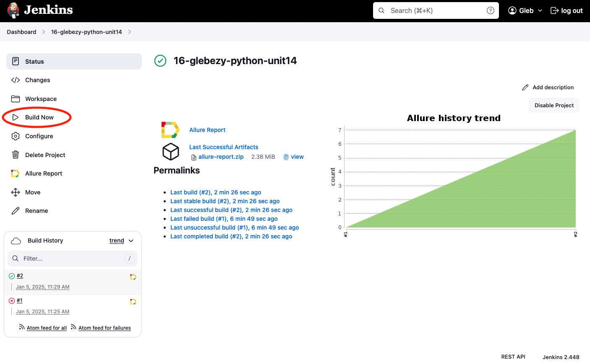
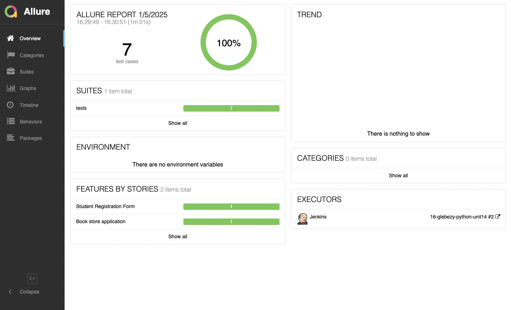
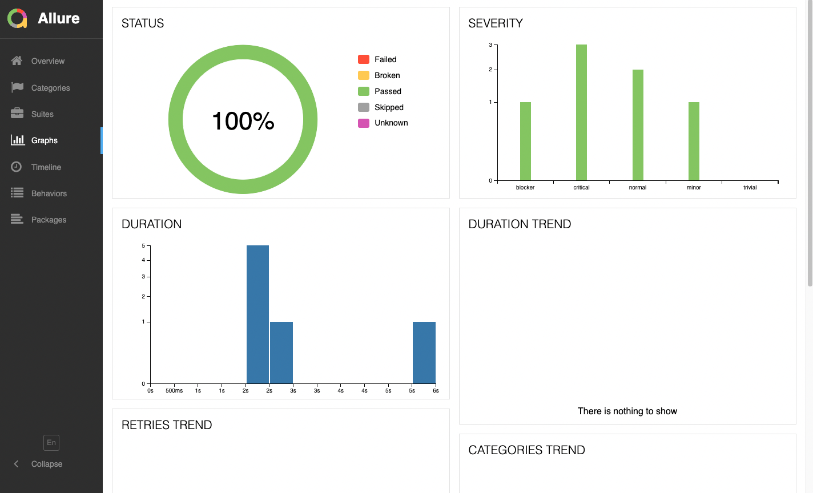
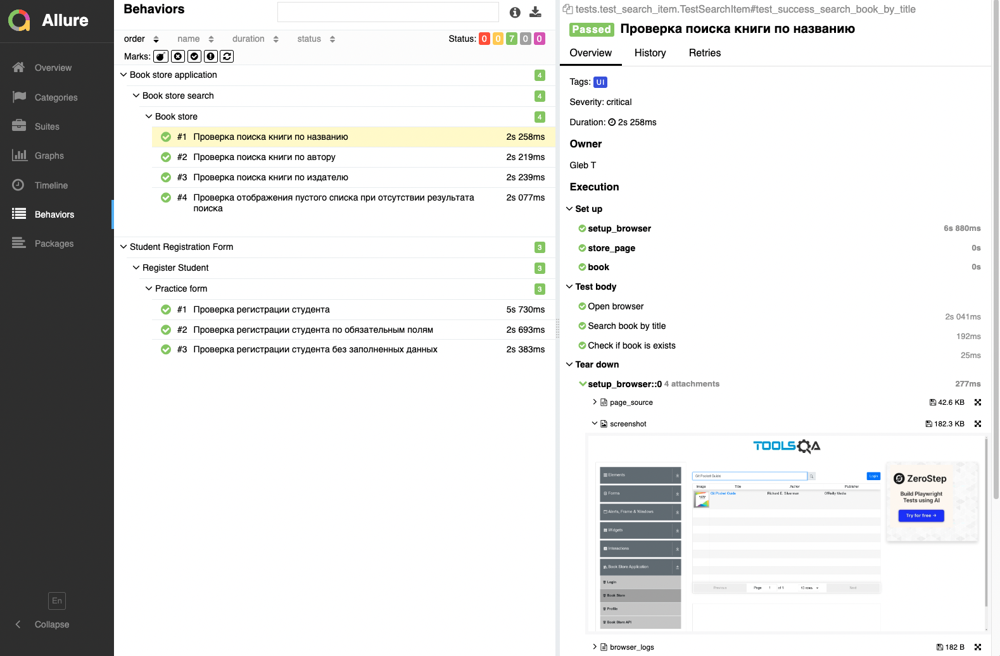
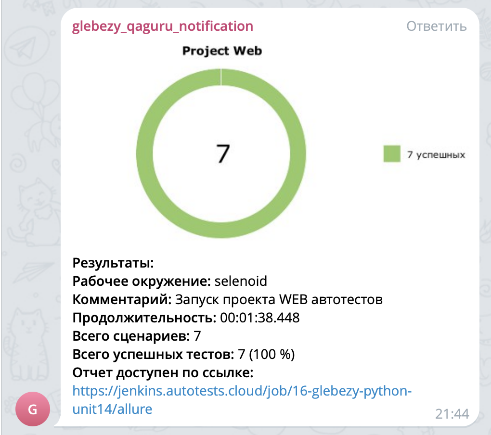

## Проект UI автотестов demoqa.com

<!-- Технологии -->

### Используемые технологии

  <code></code>
  <code></code>
  <code></code>
  <code></code>
  <code></code>
  <code></code>
  <code></code>
  <code></code>
  <code></code>
  <code></code>
  <code></code>
  <code></code>
  <code></code>

<!-- Тест кейсы -->

### Что проверяем
* Отправка формы и проверка данных всей заполненной формы
* Отправка формы и проверка данных только с заполнением главных полей
* Отправка пустой формы и проверка валидации формы
* Поиск книги по заголовку и проверка наличия в списке
* Поиск книги по автору и проверка наличия в списке
* Поиск книги по издателю и проверка наличия в списке
* Поиск невалидной книги и отображение пустого списка 

<!-- Jenkins -->

###  Запуск проекта в Jenkins

### [Job](https://jenkins.autotests.cloud/job/16-glebezy-python-unit14/)

##### При нажатии на "Build Now" начнется сборка тестов и их прохождение, через виртуальную машину в Selenide.

<!-- Allure report -->

###  Allure report

##### После прохождения тестов, результаты можно посмотреть в Allure отчете, где так же содержится ссылка на Jenkins

##### Во вкладке Graphs можно посмотреть графики о прохождении тестов, по их приоритезации, по времени прохождения и др.

##### Во вкладке Suites находятся собранные тест кейсы, у которых описаны шаги и приложены логи, скриншот и видео о прохождении теста

##### Видео прохождение теста

<!-- Telegram -->

###  Интеграция с Telegram
##### После прохождения тестов, в Telegram bot приходит сообщение с графиком и небольшой информацией о тестах.

